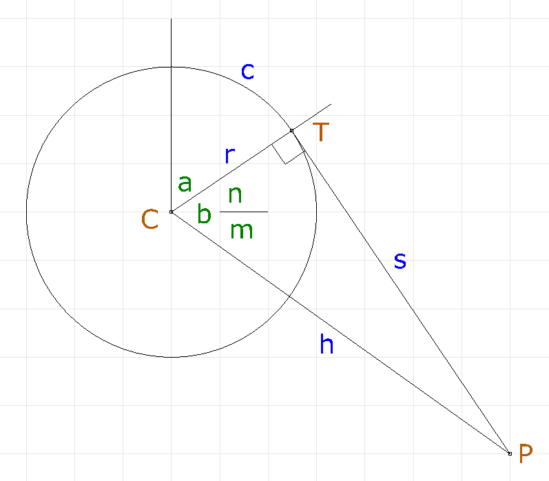

# V plotter with spool kinematics

Python code for inverse and forward kinematics.

## Legend

Points (brown)
- `C` center of circle (spool)
- `P` plotting point
- `T` tangent point, line to circle

Lengths (blue)
- `r` radius of circle
- `c` length of line in contact with circle
- `s` length of line from tangent to point
- `h` distance between plotting point and circle center

Angles (green)
- `a` section of circle with line contact
- `b` interior angle of right triangle
- `n` part angle of `b` above horizontal
- `m` part angle of `b` below horizontal

## Description

Length of line is measured from the top of the spool, consisting
of sections `c` in contact with the spool, and section `s` running
to point `P`.

Inverse kinematic calculation: given point to plot `P` find length
of line.

(later, todo) Forward kinematic calculation: given two lengths of line, find
plotting point `P`.
