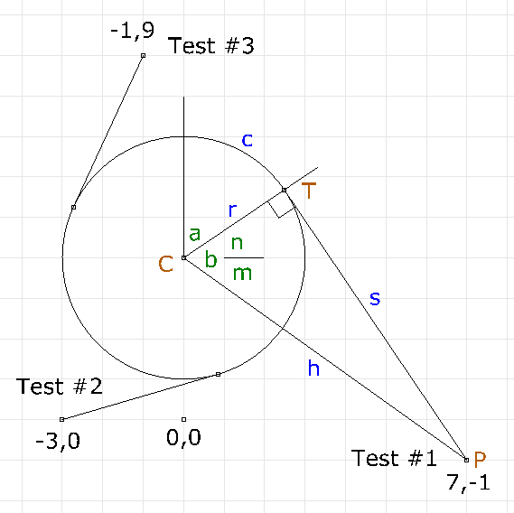
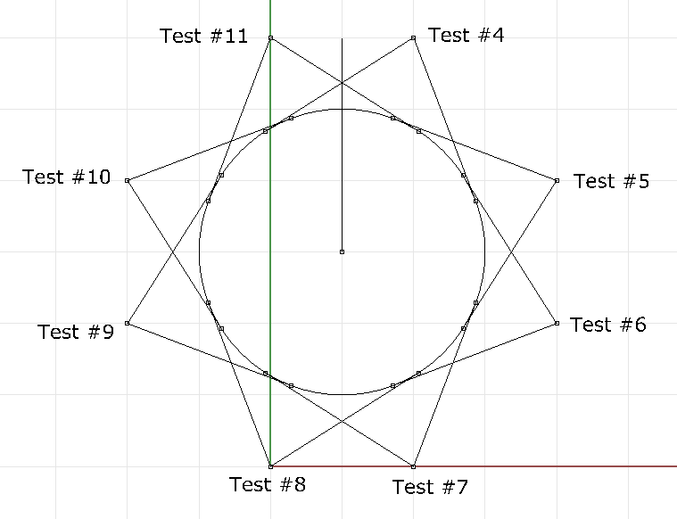
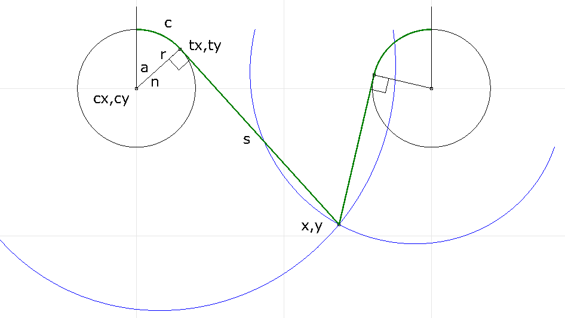

# V plotter with spool kinematics

Python code for inverse and forward kinematics.

## Legend

Points (brown)
- `C` center of circle (spool)
- `P` plotting point
- `T` tangent point, line to circle

Lengths (blue)
- `r` radius of circle
- `c` length of line in contact with circle
- `s` length of line from tangent to point
- `h` distance between plotting point and circle center

Angles (green)
- `a` section of circle with line contact
- `b` interior angle of right triangle
- `n` part angle of `b` above horizontal
- `m` part angle of `b` below horizontal

## Description

Length of line is measured from the top of the spool, consisting
of sections `c` in contact with the spool, and section `s` running
to point `P`.

Measuring the start of the line length from the top of the spool
is arbitrary. It is a convienient reference point when calculating
the linear distance equivalent of a stepper motor's rotation step.

Diagram above shows line being spooled out in a
clockwise rotation. This configuration is normally used on the left
side of a v plotter. Code calculates both clockwise and counter clockwise
unspooling. 

Inverse kinematic calculation: given point to plot `P` find length
of line.

(later, todo) Forward kinematic calculation: given two lengths of line, find
plotting point `P`.

## Tests

Diagram of the first few test cases in test.txt. Values in the test are in
agreement with 'Analyze, Length' measurements in the Rhino.

Test #3 is interesting in that it shows that the top of the spool is an
arbitrary line length measurement starting point.
The effect of the calculation is as if the length of the line
not touching the spool is added, and the length of the line which
would touch if wrapped around is subtracted.

### All Quadrants

Full circle test. Clockwise and counter clockwise unspooling with
at least two test points per quadrant.

See test.txt file for exact values.

Negative length values can be provoked with points closer
to the surface near the top of the cylinder. Not sure I want
to do anything about this as:
1. Plot points will be generally be much further away from the 
cylinder than any of these test cases, thus never provoking a 
negative length value.
2. Lines will be sloping down from the cylinder in real life, upward
sloping lines to plot points were included to stress the limits of the 
calculation.

## Forward Calculation

Given the lengths of the control lines, calculate the resulting
x,y plot value.

### Legend

Points
- `cx,cy` center of circle (spool)
- `x,y` plotting point
- `tx,ty` tangent point, line to circle

Lengths
- `r` radius of circle
- `c` length of line in contact with circle
- `s` length of line from tangent to point
- c + s (green) is length of control line

Angles
- `a` section of circle with line contact
- `n` angle from `cx,cy` to `tx,ty`

Spiral curve (blue) is the path traced out by the end of the control
line when the control line is wrapped around the spool. The control
line stays the same length (c+s) as the spool is not rotated.